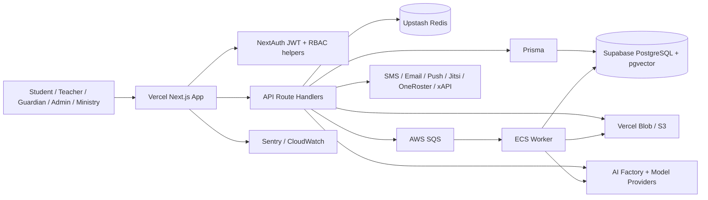
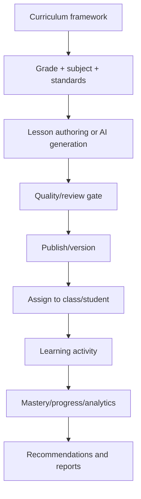

# LiberiaLearn Complete Engineering Audit

Audit basis: repository inspection, route/schema/documentation review, production smoke checks, and the validation commands required by `AGENTS.md`. No code was changed during this audit.

## 1. Executive Summary

LiberiaLearn is a live, multi-tenant K–12 learning platform built with Next.js, Prisma, PostgreSQL/Supabase, Redis, cloud object storage, role-based portals, curriculum tooling, assessment, messaging, and AI-assisted learning features. The repository is substantial: approximately 325 pages, 541 API route files, 192 Prisma models, 125 migrations, 523 test files, 12 interactive labs, and 374 schema indexes.

Overall completion is estimated at **66%** for a strong pilot product, but only **48%** for nationwide production readiness.

### Biggest strengths

- Broad product surface for students, teachers, guardians, school administrators, districts, and Ministry users.
- Real authentication, role-aware portals, tenant-aware data access, audit tables, and operational health endpoints.
- Strong AI foundation: lesson generation, quiz generation, adaptive recommendations, gap analysis, and AI quality gates.
- Large curriculum data model with versioning, publishing, assignments, progress, mastery, and assessment support.
- Production deployment is live and the main health endpoints currently respond successfully.

### Biggest weaknesses

- Curriculum coverage is uneven: current state reports 4,363 approved lessons, only 62/96 grade-subject cells at the national threshold, 34 zero-lesson deserts, and approximately 3,900 approved lessons without audio.
- Automated tests do not complete successfully; at least five failures were observed and the Vitest run timed out after 15 minutes. The required production build was therefore not run.
- Security controls are fragmented: application-layer tenant isolation, limited route-level permission checks, incomplete rate limiting, no demonstrated privileged-user MFA, permissive report-only CSP, and conditional webhook verification.
- Backups are exports rather than complete restorable database backups and include sensitive fields/PII.
- Infrastructure automation, deployment revision management, monitoring, disaster recovery, and CI security gates are not enterprise-grade.
- Schema and route families have duplication and inconsistent naming, increasing maintenance and reporting risk.

### Production readiness score

- Pilot readiness: **6.8/10**
- Nationwide readiness: **4.8/10**
- Recommendation: proceed only with a controlled pilot after closing the critical security, testing, curriculum, backup, and operations gaps.

## 2. Architecture

### Current architecture

**Frontend:** Next.js 14 App Router, React, TypeScript, Tailwind CSS, responsive portals and dashboards, service-worker/PWA behavior, rich lesson and assessment interfaces.

**Backend:** Next.js server components and route handlers. There are approximately 541 API route files covering authentication, curriculum, lessons, assignments, assessments, progress, messaging, attendance, administration, AI, integrations, and reporting.

**Database:** Supabase-hosted PostgreSQL accessed through Prisma. The schema contains approximately 192 models and 125 migrations. pgvector is used for semantic/AI capabilities. Audit immutability triggers exist in a migration.

**Authentication:** NextAuth JWT sessions; credential login supports email/login ID/student ID/guardian phone. Google SSO is available for invited teachers and administrators. Passwords use bcrypt.

**Authorization:** Role model includes STUDENT, TEACHER, GUARDIAN, ADMIN, DISTRICT_ADMIN, MOE_OFFICIAL, and platform-admin concepts. Access is enforced mainly in route code and service helpers; policy enforcement is fragmented rather than centralized.

**AI:** AI factory/provider abstractions, lesson and quiz generation, adaptive recommendations, student gap analysis, quality scoring/review gates, embeddings/vector search, and AI interaction logging. Some “AI assessment generation” paths are deterministic templates rather than model-generated content.

**Infrastructure/deployment:** Vercel hosts the web application. AWS services include SQS/ECS/CloudWatch/S3/SSM for background and operational workloads. Upstash Redis provides rate/session/cache functions. Sentry is used for error monitoring. CI builds/pushes worker images, but service revision rollout and immutable image promotion are not sufficiently explicit.

**Storage:** Vercel Blob and/or S3 for media, exports, and backup artifacts. Audio, images, lesson assets, and generated files are stored outside PostgreSQL.

**Caching:** Redis/session-freshness caching, Next.js caching, and a service worker. The service worker currently risks caching authenticated student HTML, creating shared-device privacy concerns after logout or offline reuse.

**Integrations/external APIs:** SMS, email, push notifications, Jitsi, Canva, OneRoster, xAPI, cloud AI providers, Sentry, Vercel, Supabase, AWS, and Redis providers.

### Architectural assessment

The architecture is capable of a pilot and has credible foundations for national scale, but it currently relies too heavily on route-by-route conventions, application-layer isolation, mutable deployment artifacts, and operational processes that are not yet proven through load, recovery, and security testing.

## 3. Feature Inventory

Status definitions: Complete, Mostly Complete, Partial, Prototype, Missing. Percentages are engineering/product completion estimates, not usage or learning-outcome measures.

| Feature area | Status | Estimated completion | Findings |
|---|---:|---:|---|
| Public landing, marketing, and onboarding | Mostly Complete | 85% | Live public application and role entry points; content and conversion analytics are limited. |
| Authentication and password recovery | Mostly Complete | 80% | Credentials, JWT sessions, bcrypt, and recovery exist; MFA and enterprise identity lifecycle are incomplete. |
| Google SSO/invited staff access | Partial | 70% | Implemented for selected staff flows; not a full district/MOE identity platform. |
| RBAC and tenant isolation | Partial | 65% | Many checks exist, but enforcement is fragmented and helper adoption is inconsistent. |
| Student dashboard and learning paths | Mostly Complete | 78% | Dashboard, assignments, progress, recommendations, and activities exist; offline and low-bandwidth workflows are incomplete. |
| Student lessons/content player | Mostly Complete | 75% | Lesson delivery and multimedia are present; coverage, accessibility, and audio completeness vary. |
| Quizzes and assessments | Mostly Complete | 78% | Quiz attempts, grading, feedback, and analytics exist; item quality and standards alignment require expansion. |
| Adaptive recommendations/gap analysis | Partial | 68% | AI recommendations and gaps exist; longitudinal validation and explainability are limited. |
| Interactive labs | Partial | 60% | Twelve labs are present; subject breadth, offline operation, and device compatibility need work. |
| Teacher dashboard | Mostly Complete | 80% | Class, lesson, assignment, and differentiation workflows exist; workflow consistency remains an issue. |
| Teacher lesson authoring | Mostly Complete | 78% | Draft, rich text, version/fork/share, publish, and assign flows exist; duplicate creation paths create confusion. |
| AI lesson generation | Partial | 65% | Generation and review gates exist; pass rates, backlog, and curriculum gaps remain. |
| Teacher assessment/assignment tools | Partial | 68% | Core assignment and grading paths exist; automatic generation is partly template-based. |
| Differentiation and intervention | Prototype | 50% | New dashboard/routes are present but still under active development and test coverage is failing. |
| Gradebook and mastery reporting | Mostly Complete | 75% | Grades/progress are modeled; cross-school and standards reporting is not complete. |
| Attendance | Partial | 60% | Data models and flows exist; national-grade operational reporting and integrations are incomplete. |
| Messaging and notifications | Partial | 65% | Guardian/teacher messaging and SMS/email/push adapters exist; moderation, delivery analytics, and escalation are limited. |
| Guardian/parent portal | Partial | 60% | Progress and communication views exist; payments, transport, health, safeguarding, and full family management are missing. |
| School administration | Partial | 55% | Enrollment, users, some attendance/reporting and permissions exist; scheduling, billing, HR, and operations are incomplete. |
| District administration | Partial | 50% | District access/reporting exists; comprehensive district planning and intervention tooling is missing. |
| Ministry dashboard | Prototype | 35% | Role and reporting foundations exist; national dashboards and data quality controls are largely missing. |
| Curriculum management | Partial | 55% | Framework, standards, versioning, publishing and factory artifacts exist; full Liberia-wide subject/grade coverage does not. |
| Content/media/audio pipeline | Partial | 55% | Storage and generation paths exist; approximately 3,900 approved lessons reportedly lack audio and worker processing has gaps. |
| AI observability and interaction logs | Partial | 60% | Logging and quality structures exist; cost, safety, evaluation, and model governance are incomplete. |
| Search/semantic retrieval | Partial | 60% | pgvector capability exists; relevance evaluation and operational tuning are not proven. |
| Billing, fees, and payments | Missing | 10% | No complete school fee, invoicing, reconciliation, or subscription domain. |
| HR, payroll, licensing, and staff records | Missing | 10% | Not a complete workforce-management system. |
| Safeguarding/case management | Missing | 10% | No complete confidential incident and escalation workflow. |
| Health, disability accommodations, and behavior | Missing | 10% | Required student-support domains are absent or incomplete. |
| Inventory, devices, library, transport, and facilities | Missing | 5–20% | Operational school-management domains are largely absent. |
| Offline-first mobile app | Prototype | 35% | PWA/service-worker foundations exist; reliable offline sync and conflict handling are not complete. |
| Analytics/data warehouse | Partial | 45% | Operational reports exist; national longitudinal warehouse and governed metrics are missing. |
| Import/export interoperability | Partial | 45% | OneRoster/xAPI and exports exist; production-grade reconciliation and data contracts need work. |
| Backups and disaster recovery | Partial | 35% | Export-based backups exist but are not equivalent to tested, complete, restorable backups. |
| CI/CD and release governance | Partial | 45% | Build/deploy workflows exist; required tests, security gates, immutable promotion, and rollback proof are incomplete. |
| Monitoring, support, and incident response | Partial | 45% | Sentry/CloudWatch/health checks exist; complete SLOs, on-call, runbooks, and drills are missing. |

### Validation snapshot

- `npx prisma generate`: passed.
- `npx tsc --noEmit`: passed.
- `npx vitest run`: failed/timed out after approximately 15 minutes; at least five failures were observed in schema, Ministry policy, completion, and district-access tests.
- `npm run build`: not run because the project instructions require stopping after code-validation failure.
- Live smoke checks: production home page, `/api/healthz`, and `/api/health` returned HTTP 200; health reported database and AI checks healthy, with SMS in dry-run mode.

## 4. Curriculum Engine

The curriculum engine is structurally broad but operationally incomplete. It has grade/subject/standards structures, lesson authoring, versioning, publishing, assignment, mastery, assessments, AI generation, and factory artifacts. There are 204 factory artifacts covering 17 subjects × 12 grades, but these are draft “Day-1 full-subject shells,” not evidence of ready, standards-reviewed content.

Current state reports 4,363 approved lessons, 62/96 grade-subject cells meeting the national gate, 34 zero-lesson deserts, limited English coverage, Computer Science only in Grade 5, an empty Engineering Foundations subject, and roughly 3,900 approved lessons without audio. Subject taxonomy is inconsistent (for example English/Literacy, CS/ICT/Computer Science, and Science versus Biology/Chemistry/Physics).

Teachers can create, edit, version, fork, share, publish, and assign lessons, although two overlapping creation paths can confuse users and one can be feature-flagged as “coming soon.” AI can generate lessons and assessments, but quality gates, review queues, model evaluation, localization, and coverage expansion are incomplete. The assessment-generation path is partly deterministic template generation rather than genuinely adaptive AI generation.

It can represent every subject from Grade 1 through Grade 12, but it cannot yet credibly deliver a complete, reviewed, localized, audio-supported curriculum for every cell. Missing tools include standards mapping, curriculum approval workflows, prerequisite graphs, textbook/resource alignment, bulk import/export, teacher collaboration, moderation queues, translation/localization, content analytics, version rollback, and curriculum change governance.

## 5. Student Experience

The student can register/log in, view a dashboard, follow assigned learning, read lessons, complete quizzes and activities, receive feedback, and see progress/recommendations. The experience is viable for a connected pilot.

Likely student frustrations are inconsistent content availability, missing audio, weak offline behavior, limited low-bandwidth optimization, incomplete accessibility/local-language support, unclear remediation paths, limited peer/collaborative learning, and lack of a reliable cross-device sync/conflict experience. Shared-device service-worker caching also creates a privacy risk.

## 6. Teacher Experience

Teachers can manage classes, author lessons, generate AI content, assign work, grade, inspect progress, and use differentiation features. The foundation is one of the strongest areas.

Remaining friction includes duplicate lesson-creation flows, unfinished differentiation workflows, inconsistent terminology, manual roster and data maintenance, weak bulk operations, incomplete standards alignment, limited offline operation, insufficient content/audio coverage, limited parent communication controls, and lack of integrated attendance, scheduling, safeguarding, and intervention workflows.

## 7. Parent Experience

Parents/guardians can access a portal, view student progress and assignments, and communicate through available messaging/notification paths.

Missing capabilities include fee/payment management, transport, health and attendance alerts, safeguarding visibility with proper confidentiality, family-wide account management, consent workflows, calendar/scheduling, language preferences, device support, downloadable reports, and proactive intervention recommendations.

## 8. School Administrator Experience

Administrative foundations include enrollment/user management, role assignment, some attendance and reporting, school-level access, and permissions.

The administration product is not complete for school operations. Missing or incomplete areas include timetable/scheduling, room/resource allocation, staff HR and licensing, payroll, fee collection and reconciliation, procurement, inventory/device management, library/textbook loans, transport, facilities/infrastructure, safeguarding case management, support tickets, bulk imports, data-quality workflows, comprehensive messaging, analytics, and delegated/custom permissions.

## 9. Ministry of Education Dashboard

The Ministry needs governed national indicators, not only administrative views. Missing priority dashboards include:

- National enrollment, attendance, retention, dropout, completion, and transition.
- Teacher deployment, vacancies, qualifications, attendance, workload, and performance.
- School and county comparisons with confidence intervals and data-quality flags.
- National and county examination performance, item analysis, and equity gaps.
- Curriculum adoption, lesson coverage, standards mastery, textbook/resource availability, and language coverage.
- AI insights with explanations, confidence, bias monitoring, human approval, and cost reporting.
- Dropout-risk and intervention tracking with safeguarding controls.
- Infrastructure, electricity, connectivity, devices, WASH, classroom capacity, and accessibility.
- Budget allocation, expenditure, grants, procurement, and value-for-money analytics.
- Teacher training completion, inspection findings, disaster/closure reporting, and public transparency exports.

## 10. AI Capabilities

### Implemented

- AI lesson generation and quality/review gates.
- Quiz/question generation and feedback.
- Student learning-gap analysis.
- Adaptive recommendations.
- Embeddings/vector retrieval.
- AI interaction/logging structures.
- Some automated content/media generation and workflow orchestration.

### Should exist, prioritized

**P0:** model/provider failover, prompt-injection and data-exfiltration defenses, PII redaction, privileged human approval, model/version traceability, cost budgets, evaluation sets, hallucination checks, and safe national-content moderation.

**P1:** multilingual Liberian content generation, standards-grounded lesson plans, teacher copilot, differentiated worksheets, rubric grading with human review, parent-language summaries, speech/audio tutoring, early-warning interventions, and curriculum gap forecasting.

**P2:** adaptive mastery sequencing, teacher coaching analytics, national policy simulation, resource allocation optimization, and research-grade learning-outcome experimentation.

## 11. Database Review

The schema is extensive but has overlapping model families: Homework/Assignment, Attendance/AttendanceRecord, Assessment/AssessmentAttempt/Submission/Grade, Lesson/CurriculumContent/LessonVersion, Message/GuardianMessage, AIInteraction/AiInteractionLog, and multiple progress/mastery/snapshot models.

Priority findings:

- Standardize domain ownership and canonical models before adding more features.
- Replace free-form status strings with enums and documented state machines; approximately 53 models use status strings.
- Verify query plans and add composite indexes for tenant/school/district, user, class, status, date, and curriculum dimensions; static review found approximately 80 relation fields without an obvious leading index.
- Add uniqueness and idempotency constraints for imports, assignments, attempts, payments, and event processing.
- Partition or archive high-volume event, audit, telemetry, and AI-interaction tables.
- Enforce tenant boundaries with database policies/RLS where practical, not only application conventions.
- Separate PII/secrets from routine exports and establish retention/deletion policies.
- Make migrations reversible where safe and test them against production-sized data.

## 12. Security Audit

Authentication is credible for a pilot, but enterprise deployment is blocked by missing privileged-user MFA, incomplete identity lifecycle/SCIM, fragmented authorization, limited centralized permission checks, and no evidence of independent penetration testing.

Additional concerns include report-only CSP with `unsafe-inline`, conditional SMS webhook HMAC verification, incomplete rate limiting (direct use observed in only a minority of routes), fail-open behavior when some infrastructure dependencies are unavailable, swallowed audit-log write failures, application-only tenant isolation, and sensitive tracked documentation containing what appears to be a VAPID private key. The service worker may cache authenticated student HTML. Backups contain hashed passwords and guardian PII.

Required controls include enforced MFA for staff/MOE, centralized policy middleware, default-deny tenant checks, mandatory audit delivery, secret rotation/scrubbing, strict CSP, verified webhooks, comprehensive rate limiting/WAF, security headers, dependency/container/SAST/DAST scanning, vulnerability management, threat modeling, and incident-response exercises.

## 13. Performance Review

The application has caching and a large route surface, but performance evidence is incomplete. Existing load documentation reports browse p95 around 7.2 seconds against a 1.5-second target, and the national 5,000-user gate is inconsistent or not closed.

Likely bottlenecks include dashboard aggregation, guardian N+1 query patterns, large Prisma joins, AI synchronous work, unbounded reports, unoptimized media/audio delivery, and a large client bundle. Add query-plan baselines, pagination, server-side aggregation, background jobs, CDN/media transforms, route-level cache policy, lazy loading, bundle budgets, and sustained load testing.

## 14. Mobile Readiness

The responsive web/PWA foundation can become a national app, but it is not yet a dependable national mobile product. It needs offline-first data models, queued writes, conflict resolution, resumable media, aggressive compression, low-bandwidth UX, Android/tablet device testing, accessibility, local-language support, secure shared-device handling, push reliability, and an app-store/release process.

## 15. Infrastructure

Hosting and cloud primitives are present: Vercel, Supabase/PostgreSQL, Redis, AWS queues/workers/storage/monitoring, and Sentry. However, Terraform is not a real infrastructure-as-code baseline (`infra/terraform.zip` contains a Terraform executable rather than a maintainable stack), worker deployment does not clearly register/update immutable service revisions, and mutable `latest` images weaken rollback confidence.

CI/CD lacks complete test gates, Playwright coverage in CI, SAST/DAST/SBOM/container/dependency scanning, migration safety gates, release approvals, and proven rollback. Backups are CSV exports to Blob, may cap tables at 50,000 rows, include sensitive fields, and are not proven restorable full-database backups. Define RPO/RTO, use encrypted versioned backups/PITR, test restores, add multi-region or documented regional recovery, establish SLOs, alerts, runbooks, on-call, and disaster-recovery drills.

## 16. Missing Features

### Critical before nationwide launch

- Complete curriculum coverage and quality review for every grade/subject/county-language requirement.
- Passing automated test suite and successful production build.
- Privileged MFA, centralized authorization, tenant-isolation tests, strict CSP, verified webhooks, and comprehensive rate limits.
- Complete encrypted backups, PITR/restore testing, disaster recovery, and incident response.
- Immutable deployment promotion, rollback, observability, SLOs, and on-call.
- National data governance, consent, retention, safeguarding, and privacy controls.
- Reliable offline/low-bandwidth operation and shared-device privacy.
- National Ministry dashboards with metric definitions and data-quality controls.

### Important

- Scheduling, billing/payments, HR/payroll/licensing, inventory, library, transport, facilities, health, behavior, accommodations, support desk, bulk import/export, and custom delegated roles.
- Better teacher bulk workflows, standards mapping, moderation, localization, audio pipeline, and accessibility.
- Data warehouse, interoperability contracts, analytics governance, and mobile release process.

### Future

- Advanced AI tutoring, speech assessment, national simulations, predictive resource allocation, public transparency portal, research APIs, and ecosystem marketplace.

## 17. Technical Debt

| Debt | Estimated effort |
|---|---:|
| Resolve failing/timed-out tests and establish deterministic CI | 3–6 weeks |
| Consolidate duplicate curriculum/assessment/progress models | 6–12 weeks |
| Centralize RBAC/tenant policy enforcement and add authorization tests | 6–10 weeks |
| Security hardening, secret rotation, CSP, webhook/rate-limit work | 4–8 weeks |
| Backup/DR redesign and restore drills | 3–6 weeks |
| Deployment/IaC/release modernization | 4–8 weeks |
| Query/index/performance optimization | 4–8 weeks |
| Service-worker/offline/privacy redesign | 6–12 weeks |
| Curriculum taxonomy and content-quality remediation | 12–24+ weeks plus SMEs |
| Monitoring, SLOs, on-call, runbooks, and incident exercises | 3–6 weeks |

## 18. National Rollout Readiness

I would **not approve nationwide deployment tomorrow**. The highest-priority blockers are:

1. Security and privacy controls are not yet enterprise-grade.
2. Automated validation is failing and the production build is unverified.
3. Curriculum coverage and audio/localization have material gaps.
4. Backup, recovery, deployment rollback, and operational ownership are unproven.
5. National analytics, governance, safeguarding, and data-quality controls are incomplete.
6. Offline/low-bandwidth and shared-device behavior is not ready for Liberia-wide conditions.
7. Core school-operations domains are missing.

Approve a limited, instrumented pilot only after P0 security, test, backup, and curriculum acceptance criteria are signed off.

## 19. Roadmap

### 30 days

- Fix all observed test failures/timeouts and run the full required validation pipeline.
- Rotate/remove exposed secrets and enforce staff/MOE MFA.
- Centralize authorization and add tenant-isolation regression tests.
- Replace report-only CSP, require webhook signatures, and expand rate limiting.
- Freeze a canonical curriculum taxonomy and publish a gap-remediation plan.
- Replace sensitive CSV backups with encrypted, complete, restorable backups.
- Document release rollback, SLOs, alerts, ownership, and incident runbooks.

### 90 days

- Close zero-lesson deserts and prioritize high-enrollment grade/subject cells.
- Ship reliable attendance, teacher/class, parent-alert, and Ministry baseline dashboards.
- Complete offline/low-bandwidth MVP for student lessons and assessments.
- Add real Terraform, immutable worker releases, migration gates, security scanning, and Playwright smoke tests.
- Optimize top dashboard/report queries and publish performance budgets.
- Establish safeguarding, privacy, retention, consent, and data-governance processes.

### 6 months

- Deliver national curriculum coverage with audio/localization targets and quality audit.
- Add scheduling, fees/payments, staff records, inventory, facilities, and core safeguarding.
- Launch governed national data warehouse and county reporting.
- Complete DR exercises, penetration test, load test, and independent accessibility review.
- Release supported Android/tablet clients or a hardened PWA with field telemetry.

### 12 months

- Scale to national operations with multi-region recovery and mature SRE practices.
- Add advanced AI tutoring/coaching under audited model governance.
- Integrate national exams, teacher licensing/training, OneRoster/xAPI partners, and budget/infrastructure systems.
- Publish outcome evidence, public reporting boundaries, and a sustainable support/training model.

## 20. Final Scorecard

Scores are out of 10.

| Area | Score |
|---|---:|
| Architecture | 7.3 |
| Code quality | 6.2 |
| Security | 4.8 |
| Scalability | 5.1 |
| UX | 6.5 |
| Teacher experience | 6.9 |
| Student experience | 7.0 |
| AI | 7.4 |
| Curriculum | 5.4 |
| Infrastructure | 4.9 |
| Deployment | 5.6 |
| Overall | 6.1 |

Current completion is estimated at **66%** for the product and approximately **48%** for nationwide readiness. Remaining engineering is approximately **12,000–18,000 hours**, plus curriculum subject-matter experts, field implementation, training, legal/privacy work, support, and government coordination. A completed and adopted platform could represent approximately **$4M–$8M** of replacement engineering value and potentially **$15M–$50M** of enterprise value, contingent on adoption, outcomes, contracts, and operational proof.

### External-review perspective

- **YC:** would praise the large real-world problem, breadth, and early product surface; would criticize lack of tight evidence of retention, learning outcomes, and repeatable distribution.
- **OpenAI:** would praise the AI architecture and education use case; would criticize evaluation, safety, PII controls, model governance, and the gap between generated content and approved curriculum.
- **Microsoft:** would praise cloud integration and institutional potential; would criticize identity governance, DevSecOps, compliance, DR, and enterprise integration maturity.
- **Google:** would praise data/AI and national-scale potential; would criticize data quality, analytics governance, performance evidence, and mobile/low-bandwidth readiness.
- **Liberian Ministry of Education:** would praise national curriculum ambition and multi-stakeholder portals; would criticize incomplete coverage, missing operational dashboards, offline reliability, local support/training, privacy safeguards, and lack of proven nationwide operations.

